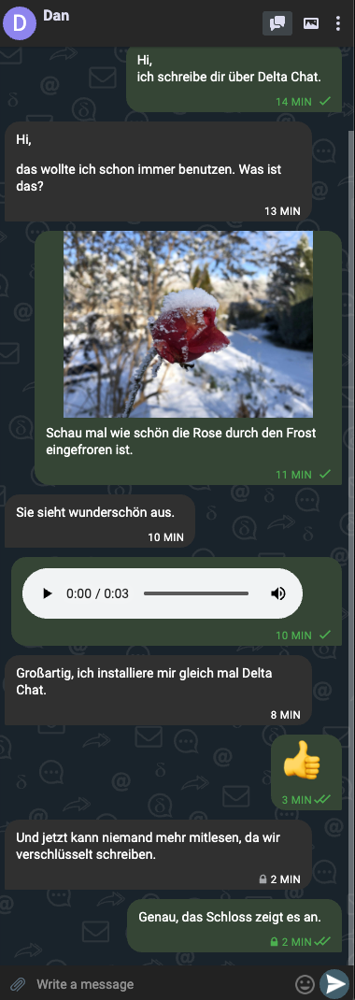

## Wilkommen auf meiner Info-Seite zu Delta Chat

Du bist auf diese Seite gekommen, da du einen Link in meiner E-Mail-Signatur angeklickt hast, die ich über Delta Chat an dich geschickt habe. 
Für dich sieht es noch wie eine normale E-Mail aus, doch für mich ersetzt dieser Chat WhatsApp und Co. 
Vielleicht bist du neugierig genug oder möchtest auch den in Kompfort von Delta Chat kommen. 
Auf dieser Seite findest du kurz ein paar Infos zu dem Chat und die Details gibt es auf der [Homepage von Deta Chat](https://delta.chat/de/).

### Delta Chat ist wie Chatten nur besser

Die App sieht aus und lässt sich bedienen wie jede andere Chat-App, aber deine Chat-Partner benötigen nur eine E-Mail-Adresse.

So sieht ein Chatverlauf aus.

Hier chatte ich mit Dan und schicke ihm ein Bild und eine Sprachnachricht. Weiter unten installiert er sich die App und wir schreiben automatisch verschlüsselt. Es gibt [Delta Chat Apps](https://delta.chat/en/download) für iOS, Android, Mac, Linux und Windows. Man kann auch Gruppenchats mit mehreren Leuten anlegen.

### Delta Chat für immer

Kommuniziert wird über die eigene E-Mail-Adresse. 
Es wird kein Anbieter benötig, der die Nachrichten verwaltet. 
Daher wird Delta Chat auch dann noch laufen, wenn WhatsApp und Co. ihre Dienste einstellen.

### Schütze deine Kontakte

Delta Chat lädt nicht dein Adressbuch an irgendeine Firma hoch. 
Wenn du WhatsApp verwendest, dann gibst du die Daten deiner Freunde und Geschäftsparnter an Facebook weiter und zwar auch von Leuten, die dir nicht erlaubt haben, ihre Daten an Facebook zu spenden.

### Schütze dich automatisch

Sobald deine Chatpartner auch Delta Chat verwenden, ist die Kommunikation über AutoCrypt (PGP) verschlüsselt.
Du musst dafür nicht weiter tun.
Achte nur auf das Schloss an der Nachricht.

### Ich will auch Delta Chat!

Delta Chat gibt es bei Google Play, im AppStore bei Apple

im Google Play Store

oder auch als [Download](https://delta.chat/de/download).

Zur Einrichtung gibst du deinen E-Mail-Zugang an, so wie bei jedem anderen E-Mail-Programm auch.

Viele Fragen kann die [Delta Chat FAQ](https://delta.chat/de/help) beantworten.

### Es geht nicht, Hilfe!

Melde dich bei mir, ich helfe dir bei der Einrichtung.

### Och nö, noch mehr Apps?

Antworte einfach per E-Mail. 
Du brauchst kein Delta Chat, um mit mir zu schreiben.
